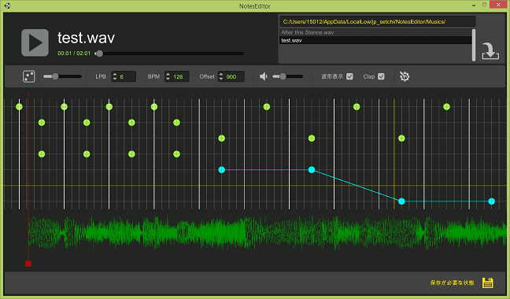

# Note Editor  
音楽ゲーム用の譜面エディタです。
現在wav形式の音楽ファイルのみ対応しています。[English](https://translate.google.com/translate?sl=ja&tl=en&u=https://github.com/setchi/NoteEditor) (by Google Translate)

## コマンド一覧
### 一般的なコマンド
| アクション | コマンド |
|:-----------|:------------|
| 元に戻す     |   Ctrl + Z    |
| やり直し     |   Ctrl + Y    |
| 保存する     |   Ctrl + S    |

### 譜面の操作
| アクション | コマンド |
|:-----------|:------------|
| 拡大/縮小する | 上下矢印キー / Ctrl + マウスホイール |
| 現在位置を移動する | 左右矢印キー / マウスホイール / 波形部分を左右にドラッグ |
| 現在位置を素早く移動する | Ctrl + 左右矢印キー |
| 再生 / 停止 | Space |
| ノーツをすべて選択する | Ctrl + A |
| ノーツを範囲選択する    |     Ctrl + 譜面をドラッグ   |
| 選択対象をコピーする    |    Ctrl + C     |
| 選択対象を切り取る     |   Ctrl + X    |
| 選択対象を削除する | Delete / Back space |
| コピー対象を張り付ける       |     Ctrl + V     |

### ノーツ編集モードの操作
| アクション | コマンド |
|:-----------|:------------|
| ノーツ編集モードを切替える | Alt |
| ロングノーツ編集を開始する      |      Shift + ノーツを配置    |
| ロングノーツ編集モードを解除する      |   右クリック / Esc    |

## 開発環境
Unity 2017.1.1p3

## LICENSE
MIT
